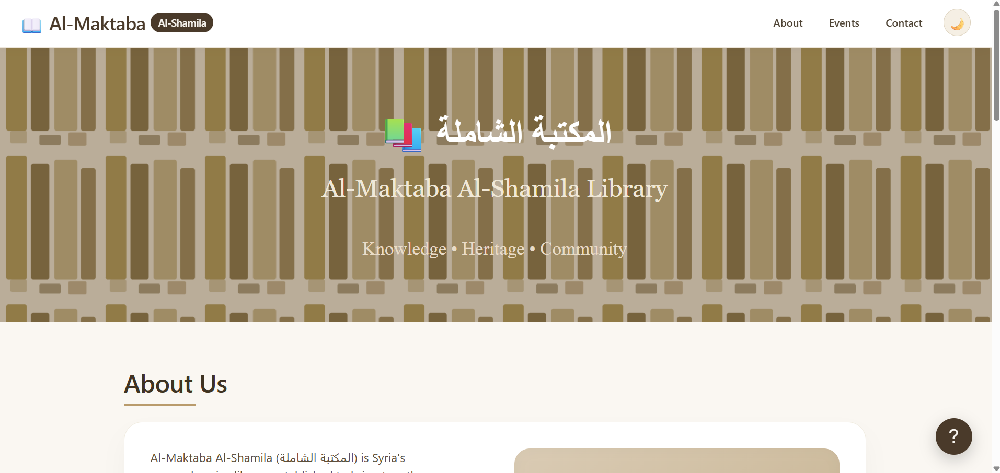
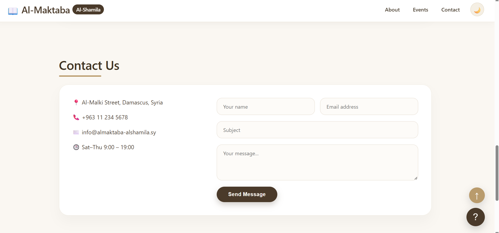

# 📖 Al-Maktaba Al-Shamila | المكتبة الشاملة

هاد مشروع موقع تعريفي لمكتبة "المكتبة الشاملة" في سوريا، سويته كجزء من رحلتي بتعلم البرمجة. الموقع بيعرض معلومات عن المكتبة، الأحداث القادمة، وطريقة التواصل معها.

## 📸 لقطات من الموقع

### الصفحة الرئيسية

### صفحة التواصل

## ✨ المميزات
- 🌙 وضع ليلي / نهاري (Dark Mode) مع حفظ الاختيار حتى بعد إغلاق المتصفح
- 🎠 سلايدر تفاعلي لعرض الأحداث القادمة (يتحرك بالأزرار أو بالنقط)
- 📜 تنقل ناعم بين أقسام الصفحة (Smooth Scroll)
- 💬 نافذة دعم عائمة (Floating Support) للتواصل السريع
- ⬆️ زر "العودة للأعلى" يظهر تلقائياً عند التمرير
- 📱 تصميم متجاوب (Responsive) يشتغل على الموبايل والكمبيوتر

## 🛠️ التقنيات المستخدمة
- HTML5
- CSS3 (Flexbox, Transitions, Media Queries)
- JavaScript (Vanilla JS - بدون مكتبات خارجية)
- LocalStorage لحفظ إعدادات المستخدم

## 🚀 كيف تشتغل على المشروع
المشروع بسيط وما بيحتاج أي تثبيت:
1. حمّل أو استنسخ (clone) المشروع
2. افتح ملف `index.html` مباشرة على المتصفح
3. جرب تبدل الوضع الليلي، والتنقل بين الأحداث بالسلايدر

## 📚 شو تعلمت من هاد المشروع
بلشت المشروع بمساعدة AI لفهم البنية الأساسية والتصميم، وبعدين قعدت مع الكود لفهم كل جزء فيه وقدرت أعدّل وأضيف على المنطق الموجود بنفسي. من أهم الأشياء يلي تعلمتها:

- كيف تشتغل `classList.toggle()` لتفعيل/إلغاء الوضع الليلي عبر كلاس CSS
- كيف أستخدم `localStorage` لحفظ تفضيلات المستخدم بين الجلسات
- آلية عمل السلايدر: حساب عرض العناصر ديناميكياً واستخدام `transform: translateX()` للتنقل بينها
- أهمية `event.stopPropagation()` لمنع تعارض الأحداث (events) بالجافاسكربت

---
سويت هاد المشروع كخطوة أولى بمسيرتي بتعلم تطوير الويب 🌱
